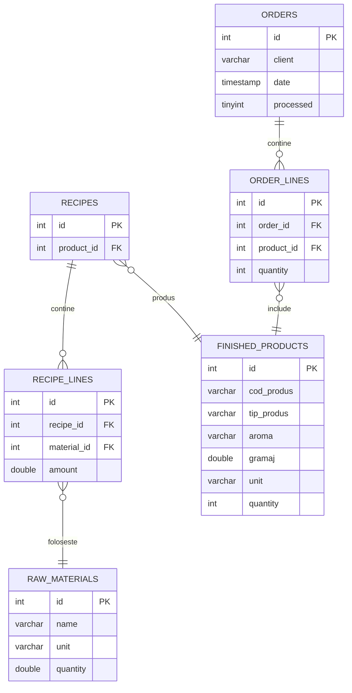
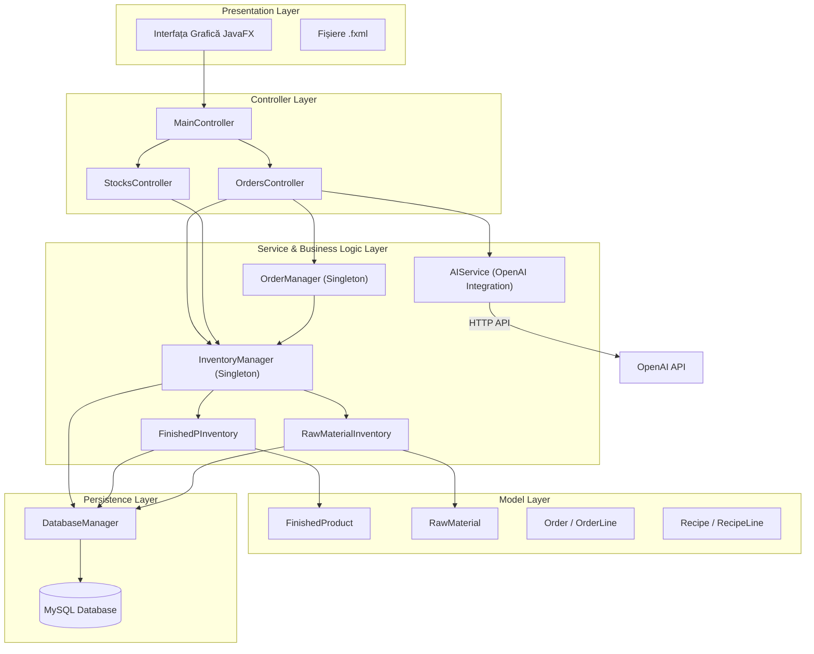

# ERP Alimentar – Sistem de Management Integrat pentru Industria Alimentară
### Neamu Flavius-Andrei

## Descriere
Aplicația ERP Alimentar este o soluție desktop dezvoltată în Java, destinată simulării proceselor principale dintr-o unitate de producție alimentară (ex: patiserie, panificație, produse ambalate).
Scopul aplicației este de a oferi o imagine clară asupra stocurilor, a materiilor prime și a fezabilității comenzilor primite, ajutând utilizatorul să răspundă rapid la întrebări esențiale precum:
„Pot onora comanda cu stocul actual?”
„Ce produse îmi lipsesc?”
„Ce materii prime trebuie să achiziționez pentru a produce cantitatea necesară?”

Prin acest sistem, utilizatorul poate gestiona eficient inventarul, planificarea producției și analiza trasabilității, într-un mod simplificat, dar realist pentru industria alimentară.

## Obiective
Proiectul urmărește dezvoltarea unei aplicații funcționale care să centralizeze procesele esențiale dintr-o fabrică de produse alimentare:
* Evidența completă a stocurilor de produse finite și materii prime
* Verificarea fezabilității comenzilor primite
* Trasabilitatea loturilor și analiza completă a lanțului de producție
* Generarea de rapoarte și analize sintetice (stocuri, trasabilitate, comenzi)

## Arhitectura
Clasele principale:

* RawMaterial: modeleaza materia prima;

* RawMInventory: reflectă stocul disponibil pentru materii prime

* FinishedProduct: reprezinta produsul finit

* FinishedPInventory: modeleza stocul de produse finite

* RecipeLine: reprezinta o "linie din reteta", clasa care modeleaza o asociere intre materiePrima -> Cantitate

* Recipe: rețeta fiecărui produs finit, contine mai multe obiecte de tip RecipeLine

* OrderLine: o "linie din comanda", o asociere intre produsFinit -> Cantitate

* Order: modeleaza o comanda a unui client, contine obiecte de tip OrderLine

Clase utilitare:

* InventoryManager: implementeaza diferite operatii legate de stocuri (materii prime + produse finite)

* RecipeBook: clasa prin intermediul careia putem accesa retetele tuturor produselor finite

* OrderManager: implementeaza operatii pe comenzi primite (procesare comenzi, verificare disponibilitate etc.)

## Conexiunea cu Baza de Date:

## Functionalitati/Exemple utilizare
* Se incarca din baza de date stocurile disponibile: materii prime si produse finite

* Se pot incarca diferite retete noi

* Când un utilizator adaugă o materie primă, se creează un RawMaterial și se salvează în baza de date.

* Când introduce o rețetă, aplicația salvează Recipe și RecipeLine, care leagă produsul finit de materiile prime.

* La o comandă, se verifică stocul cu liniile sale (OrderLine), iar dacă lipsesc produse, sistemul calculează ce materii prime sunt necesare.

